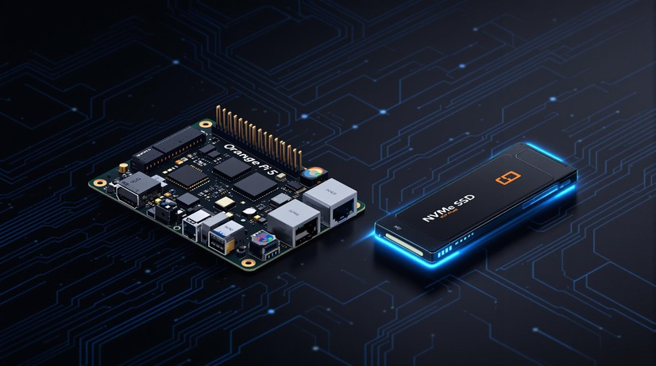

# Installing Armbian Minimal on Orange Pi 5



## Partitioning the NVMe Disk

1. Access the terminal and run:

   ```bash
   sudo fdisk /dev/nvme0n1
   ```

2. Delete all existing partitions:

   - Press **"d"** to delete each partition. Repeat until no partitions remain.

3. Create a GPT partition table (if necessary):

   - Press **"g"** to create a new GPT partition table.

4. Create the primary (root) partition:

   - Press **"n"** to create a new partition.
   - Accept the default values for the first and last sectors.

5. Change the partition type:

   - Press **"t"** and enter **83** to select Linux Filesystem.

6. Write the changes to disk:

   - Press **"w"** to save and apply the changes.

7. Sync disks with the system:

   ```bash
   sudo sync
   ```

---

## Formatting the Partition

```bash
sudo mkfs.ext4 /dev/nvme0n1p1
```

---

## Installing Armbian on the NVMe SSD

1. Run the installer:

   ```bash
   sudo armbian-install
   ```

2. Select the installation option:

   - **Option 4:** Boot from MTD Flash - system on SATA, USB, or NVMe.
   - Choose **`/dev/nvme0n1p1`** as the target for the operating system.

3. When prompted to install the bootloader, select **Yes**.
   - If you select **No**, restart the installer and choose:  
     **Option 7:** Install/Update the bootloader on MTD Flash.

---

## Finalization

1. Shut down the Orange Pi. You can use the following command or choose to power off during the installation process:

   ```bash
   sudo poweroff
   ```

2. Remove the SD card and power the Orange Pi 5 back on. It should boot directly from the NVMe SSD.

---

## Additional Notes

- **Armbian Minimal** is the required image for this process. It is ideal for IoT/Edge computing and uses a single partition.
- If you wish to install the **Server or Desktop** versions, the steps differ as they require a separate bootloader and different NVMe partitioning. Follow the guide in this post for more details:  
  [Installing OP5 NVMe Boot - Armbian Forum](https://forum.armbian.com/topic/27527-installing-op5-nmve-boot/)

- **Set a Static IP and Cloudflare DNS** (1.1.1.3, 1.0.0.3) using `armbian-config`:

  ```bash
  sudo armbian-config
  ```

- **Change the Hostname** using `hostnamectl`:

  ```bash
  hostnamectl  # Display current hostname
  sudo hostnamectl set-hostname orangepi.local
  sudo vi /etc/hosts  # Update references to the new hostname
  ```
